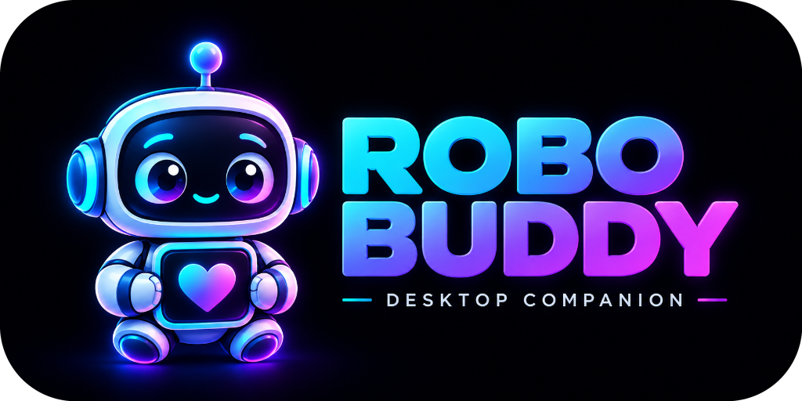

<div align="center">



# Robo Buddy

**A lightweight, reactive 3D desktop companion for Windows.**  
*In the spirit of classic desktop pets like BonziBuddy and Clippy — reimagined for modern Windows.*

[](https://github.com/MrSco/robo-buddy-releases/releases/latest)
[](https://github.com/MrSco/robo-buddy-releases/releases/latest)
[](https://robo-buddy.roccojuliano.workers.dev/)
[](https://github.com/MrSco/robo-buddy-releases/issues)

[🌐 Official Website & Live 3D Playground](https://robo-buddy.roccojuliano.workers.dev/) • [📦 Download Latest Release](#-downloads) • [📖 Features](#-features) • [🐛 Report an Issue](https://github.com/MrSco/robo-buddy-releases/issues)

</div>

---

## 📦 Downloads

| Package | Type | Description | Link |
| :--- | :--- | :--- | :--- |
| **RoboBuddy-Setup-0.7.1.exe** | **EXE Setup (Recommended)** | Standard per-user installer. Creates desktop & Start Menu shortcuts, auto-checks WebView2. | [📥 Download .exe](https://github.com/MrSco/robo-buddy-releases/releases/latest/download/RoboBuddy-Setup-0.7.1.exe) |
| **RoboBuddy-0.7.1.msi** | **MSI Installer** | Windows Installer package for system administrators and enterprise deployment. | [📥 Download .msi](https://github.com/MrSco/robo-buddy-releases/releases/latest/download/RoboBuddy-0.7.1.msi) |

> [!TIP]
> All releases, release notes, and file checksums are published on the [GitHub Releases](https://github.com/MrSco/robo-buddy-releases/releases) page.

---

## ✨ Features

- 🔊 **Web Audio Foley Soundscape**: Realistic multi-sample physical sound effects for all interactions (footsteps, landings, impacts, jumps, pokes, sleep, wake, greetings, and bubble pops) with micro-pitch jitter and dynamic velocity scaling.
- 🎵 **Audio-Reactive Beat Dancing**: Listens to desktop audio using Windows WASAPI loopback without recording or uploading anything. The beat lock algorithm locks onto tempos so Buddy only grooves when real music is playing, with intelligent gating against his own footsteps and speech.
- 🪟 **Window Physics & Edge Climbing**: Open applications act as physical platforms. Throw Buddy across the screen with drag-and-fling momentum, watch him tumble, land on app title bars, grab ledges, and climb himself up.
- 📎 **Context-Aware Clippy Mode**: Buddy detects active apps (VS Code, Chrome, Terminal, Notepad, etc.) and chimes in with clever contextual tips and interactive action chips. Sensitive applications (e.g. password managers, incognito windows) are automatically blacklisted.
- 💥 **Screensaver Havoc**: When idle, Buddy takes over the screen and treats a freeze-frame snapshot of your desktop as an arena. He leaps around breaking falling grid tiles or fractured glass cutouts before a CRT TV power-off collapse into the void.
- 📷 **Webcam Mocap & Mirror**: MediaPipe tracks body posture and 21 points per hand locally on your machine. Turn on *Mirror* to make Buddy mimic your moves live on your desktop.
- 🗣️ **Local & Cloud AI Voice**: High-speed cloud providers (Groq, Gemini) or 100% offline local LLMs via Ollama. Offline Piper neural voices synthesize speech locally with zero latency.
- 🎭 **Custom 3D Characters**: Drag-and-drop any GLB, VRM, or animated WebP/GIF pack directly onto Buddy to swap characters instantly. All animation clips are retargeted dynamically at runtime.

---

## 💻 System Requirements

- **Operating System**: Windows 10 (64-bit) or Windows 11 (64-bit)
- **Runtime**: Microsoft Edge WebView2 Runtime *(preinstalled on modern Windows 10 and 11)*
- **Audio Reaction**: Requires standard Windows audio output device (WASAPI loopback)
- **Webcam Mocap (Optional)**: Any standard USB or built-in webcam
- **AI Voice (Optional)**: Free Groq or Gemini API key, or local Ollama instance

---

## 🚀 Quick Start Guide

1. **Install**: Run `RoboBuddy-Setup-0.7.1.exe` and follow the quick setup wizard.
2. **System Tray**: Look for the Robo Buddy icon in your Windows taskbar notification area (system tray). Right-click it (or right-click Buddy himself) to access:
   - **Settings**: Audio sensitivity, character management, AI brains, and screensaver options.
   - **Bring Buddy Here**: Instantly teleports Buddy to your current cursor position.
   - **Pause / Wake**: Pauses physics and animation when you need full focus.
   - **Quit**: Closes the application.
3. **Throw & Interact**: Left-click and drag Buddy to fling him across your monitors. Click on him to trigger reactions.
4. **Drag-and-Drop Characters**: Drag any `.glb` or `.vrm` 3D model file directly onto Buddy's body to switch models on the fly.
5. **Data Directory**: User settings, custom models, and downloaded voice packs are stored cleanly in:
   ```plaintext
   %APPDATA%\com.rocco.robobuddy\
   ```

---

## 🐛 Bug Reports & Feature Requests

Encountered an issue or have a suggestion? We'd love to hear from you!

- Search existing reports or file a new bug on our [Issue Tracker](https://github.com/MrSco/robo-buddy-releases/issues).
- Please provide your Windows version, graphics hardware, and steps to reproduce.

---

<div align="center">
  <sub>Built with Tauri v2, Rust, Three.js, and Web Technologies.</sub>
</div>
